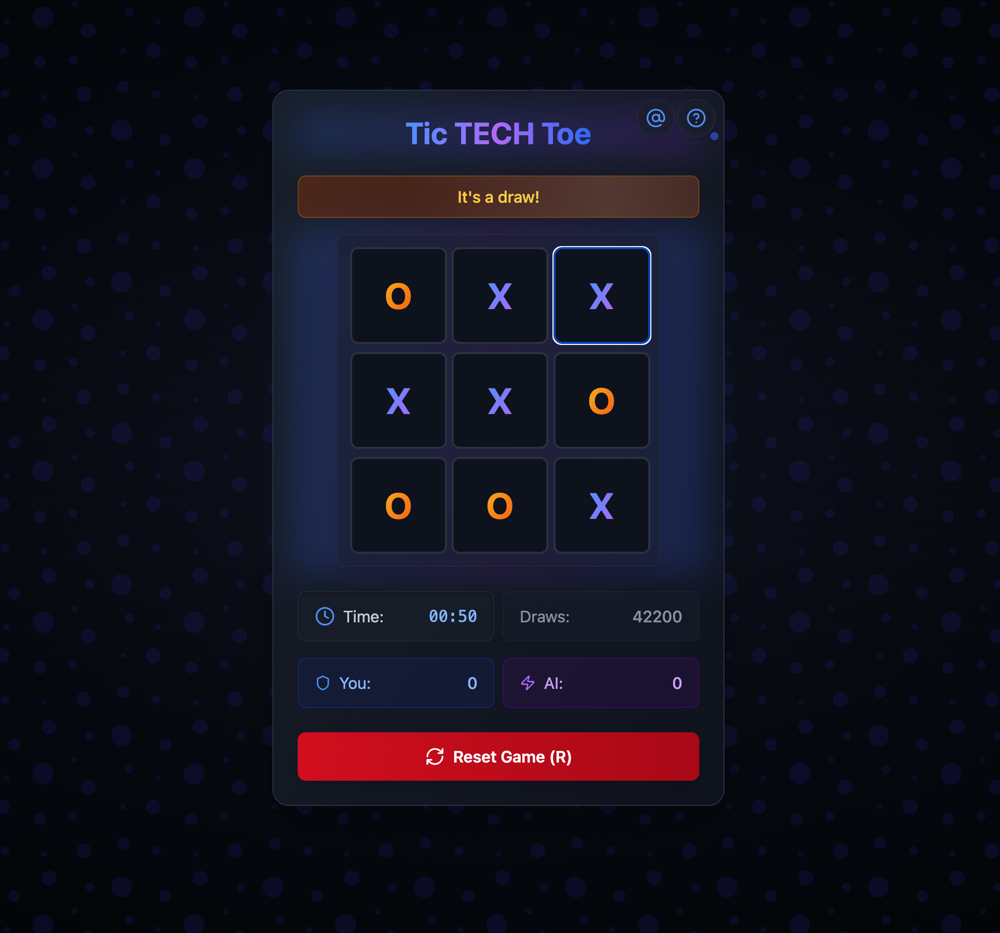
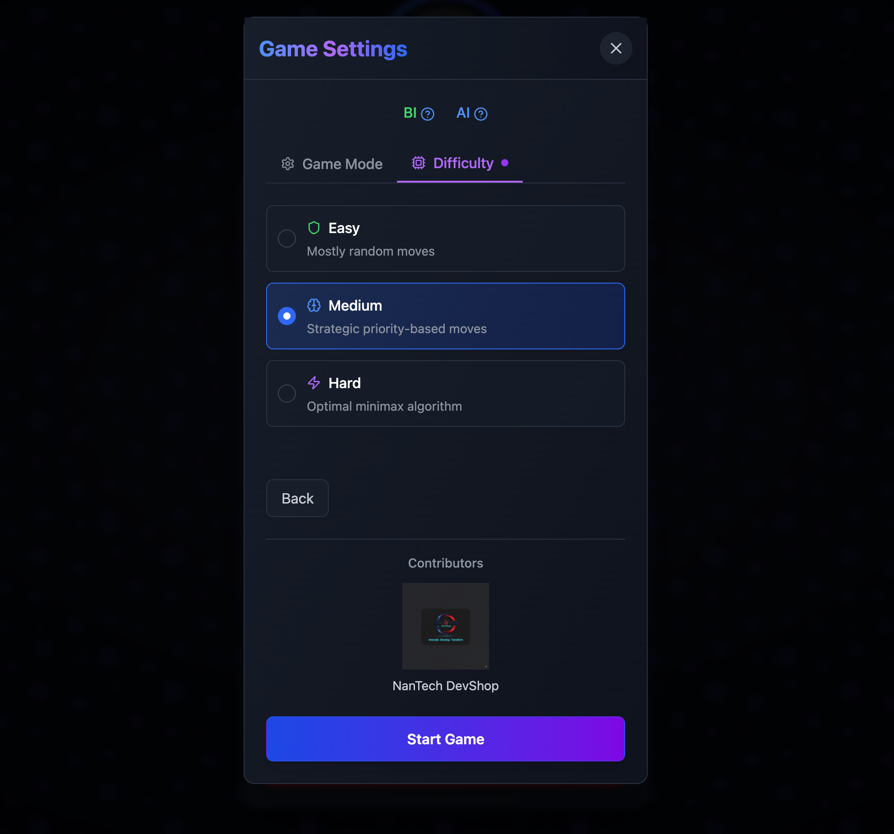
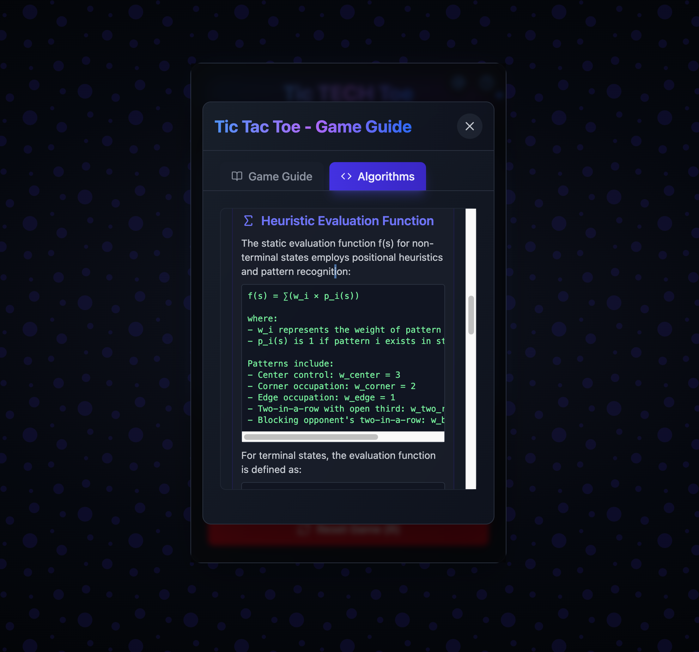
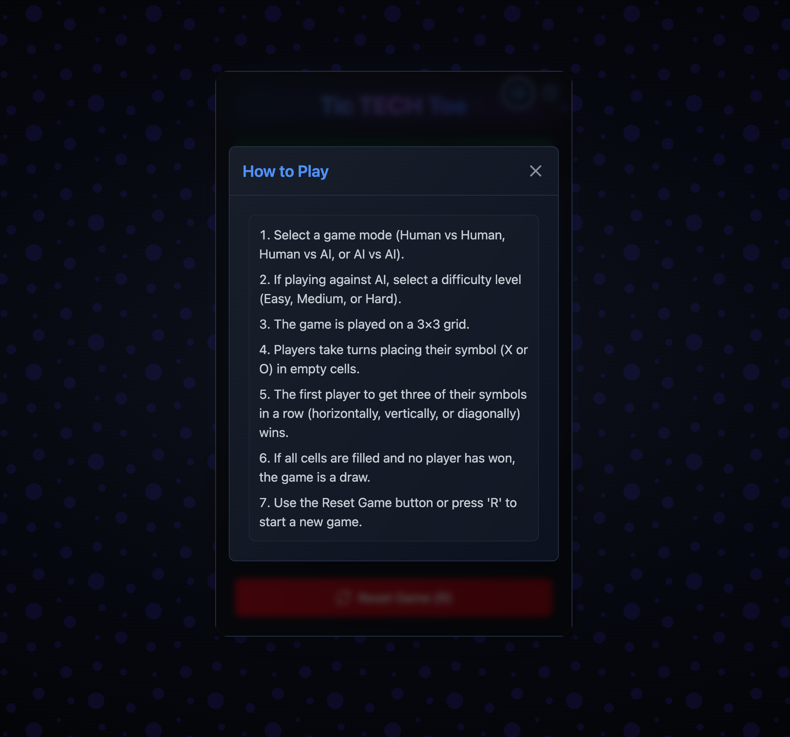
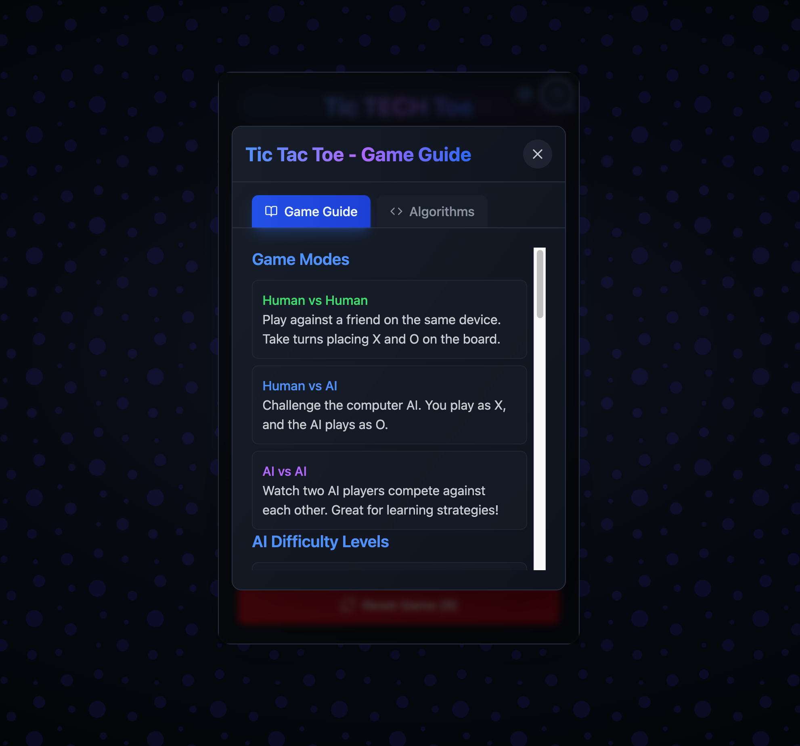
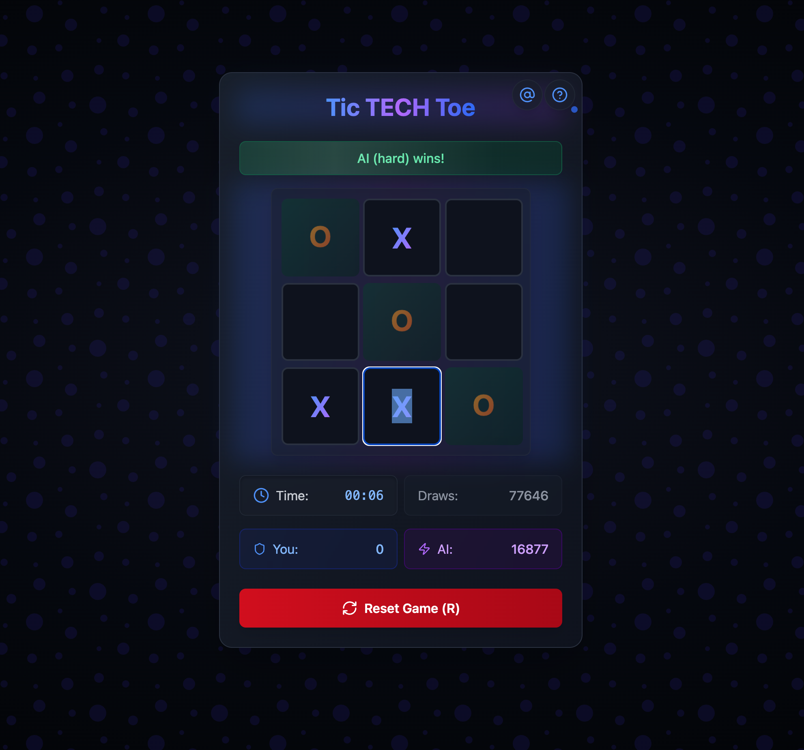

# Tic-Tac-Toe AI

<div align="center">
  
  
  A modern Tic-Tac-Toe game with AI opponents built using React, TypeScript, and Shadcn UI.
  
  

  <p align="center">
    <strong>Developed by:</strong>
  </p>
  <a href="https://nanitech.co.za">
    
  </a>
</div>

## Features

- **Three Game Modes**:
  - Human vs Human: Play against another person
  - Human vs AI: Play against an AI opponent with adjustable difficulty
  - AI vs AI: Watch two AI algorithms compete against each other

- **Adjustable AI Difficulty**:
  - Easy: Mostly random moves, perfect for beginners
  - Medium: Strategic play with prioritized moves
  - Hard: Minimax algorithm with alpha-beta pruning, extremely challenging

- **Persistent Scoring**: Game scores are saved in localStorage and persist between sessions

- **Game Timer**: Track how long each game takes

- **Mobile-First Design**: Responsive layout that works well on all devices

- **Modern UI**: Clean, accessible interface built with Shadcn UI components

<div align="center">
  <table>
    <tr>
      <td align="center">
        <strong>Game Modes</strong><br/>
        
      </td>
      <td align="center">
        <strong>AI Difficulty Levels</strong><br/>
        
      </td>
    </tr>
  </table>
</div>

## Game Screenshots and Features

### Main Game Interface

The main game interface features a clean, modern design with a 3x3 grid board. The interface includes a game timer, score display, and clear player turn indicators, all wrapped in an intuitive layout that makes gameplay smooth and enjoyable.

### AI vs AI Battle Mode

Watch two AI algorithms compete against each other in this unique mode. Observe different strategies unfold as the AIs make their moves, perfect for learning advanced gameplay tactics or just enjoying an automated match.

### Game Difficulty Selection

Choose from multiple difficulty levels to match your skill level. Whether you're a beginner or an expert, there's a perfect AI opponent waiting for you. Each difficulty level employs different strategies and algorithms.

### Algorithm Information

Dive deep into the AI algorithms powering the game. This screen provides detailed information about how each AI difficulty level works, from simple random moves to the sophisticated minimax algorithm with alpha-beta pruning.

### How to Play Guide

New to the game? Our comprehensive how-to-play guide walks you through all the game mechanics, rules, and features. Perfect for beginners or those looking to understand the game's advanced features.

### Game Guide Interface

An interactive guide interface that helps players understand game mechanics, AI behaviors, and strategic tips to improve their gameplay experience.

### Victory Moment

Experience the thrill of victory! When a player wins, the winning combination is highlighted, and the game celebrates your success with a visually appealing animation.

## AI Implementation

The game includes three difficulty levels for the AI:

1. **Easy**: Makes mostly random moves with occasional smart plays
   - 80% chance to make a random move
   - 20% chance to make a winning move if available
   - Perfect for beginners or casual play

2. **Medium**: Makes decisions based on a priority system:
   - Win if possible
   - Block opponent's winning move
   - Take center if available
   - Take corners if available
   - Take edges if available
   - Choose a random empty cell

3. **Hard**: Uses minimax algorithm with alpha-beta pruning
   - Analyzes the game tree to find optimal moves
   - Virtually unbeatable
   - Adjusts search depth based on game state for optimal performance

## Technologies Used

- React 18.2.0 with TypeScript
- Vite 5.0.10
- Tailwind CSS 3.4.0
- UI Components: Using utility libraries like class-variance-authority, clsx, and tailwind-merge
- Icons: Lucide React
- Linting: ESLint 8.56.0 with TypeScript ESLint

## Project Structure

```
Tic-Tac-Toe-AI/
├── src/
│   ├── components/
│   │   └── game/
│   │       └── Game.tsx
│   ├── App.tsx
│   ├── main.tsx
│   └── index.css
├── public/
├── node_modules/
├── index.html
├── package.json
├── package-lock.json
├── vite.config.ts
├── tailwind.config.js
├── eslint.config.js
├── tsconfig.json
└── README.md
```

## Getting Started

### Prerequisites

- Node.js (v18 or higher recommended)
- npm or yarn

### Installation

1. Clone the repository:
   ```bash
   git clone https://github.com/yourusername/tic-tac-toe-ai.git
   cd tic-tac-toe-ai
   ```

2. Install dependencies:
   ```bash
   npm install
   ```

3. Start the development server:
   ```bash
   npm run dev
   ```

4. Open your browser and navigate to `http://localhost:5174` (or the port shown in your terminal)

## Building for Production

```bash
npm run build
```

The built files will be in the `dist` directory.

## Dependency Management Best Practices

This project follows these dependency management best practices:

### 1. Peer Dependency Compatibility

- Always check peer dependencies before upgrading major libraries
- Use `npm ls --all` to identify peer dependency conflicts
- Consult library release notes for compatibility information
- Example: Testing Library requires React 18.x, not compatible with React 19.x

### 2. Semantic Versioning Strategy

- Use caret (`^`) for most dependencies to get minor and patch updates: `^18.2.0`
- Use tilde (`~`) for patch-only updates when minor versions might introduce breaking changes: `~5.3.3`
- Use exact versions for critical dependencies with known compatibility issues: `18.2.0`
- Be cautious with major version upgrades, especially for core libraries

### 3. Dependency Resolution

- Use explicit `overrides` in package.json instead of `--legacy-peer-deps`:
  ```json
  "overrides": {
    "react": "^18.2.0",
    "react-dom": "^18.2.0"
  }
  ```
- This ensures consistent dependency resolution across all environments
- Prefer targeted overrides over blanket flags like `--force`

### 4. Automated Updates

- Use `npx npm-check-updates -u --target minor` to update to compatible minor versions
- Consider setting up Dependabot or Renovate for automated PRs
- Always run tests after updating dependencies
- Update in small batches to isolate potential issues

### 5. TypeScript Configuration

- Ensure TypeScript compiler options are compatible with your TypeScript version
- Use `composite: true` when using `tsBuildInfoFile` option
- Remove deprecated or unsupported compiler options

## License

MIT
