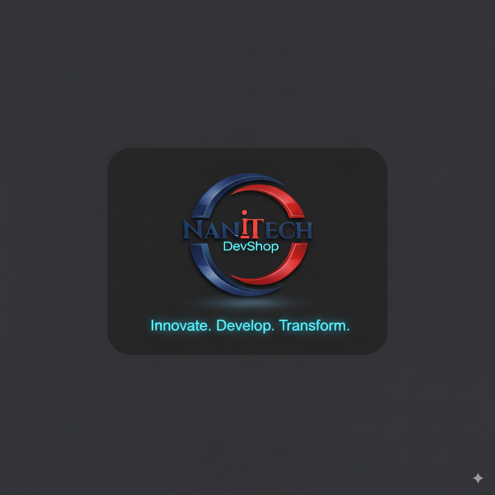

# Tic-Tac-Toe AI

<div align="center">
  
  
  A modern Tic-Tac-Toe game with AI opponents built using React, TypeScript, and Shadcn UI.
  
  

  <p align="center">
    <strong>Developed by:</strong>
  </p>
  <a href="https://nanitech.co.za">
    
  </a>
</div>

## Features

- **Three Game Modes**:
  - Human vs Human: Play against another person
  - Human vs AI: Play against an AI opponent with adjustable difficulty
  - AI vs AI: Watch two AI algorithms compete against each other

- **Adjustable AI Difficulty**:
  - Easy: Mostly random moves, perfect for beginners
  - Medium: Strategic play with prioritized moves
  - Hard: Minimax algorithm with alpha-beta pruning, extremely challenging

- **Persistent Scoring**: Game scores are saved in localStorage and persist between sessions

- **Game Timer**: Track how long each game takes

- **Mobile-First Design**: Responsive layout that works well on all devices

- **Modern UI**: Clean, accessible interface built with Shadcn UI components

<div align="center">
  <table>
    <tr>
      <td align="center">
        <strong>Game Modes</strong><br/>
        
      </td>
      <td align="center">
        <strong>AI Difficulty Levels</strong><br/>
        
      </td>
    </tr>
  </table>
</div>

## AI Implementation

The game includes three difficulty levels for the AI:

1. **Easy**: Makes mostly random moves with occasional smart plays
   - 80% chance to make a random move
   - 20% chance to make a winning move if available
   - Perfect for beginners or casual play

2. **Medium**: Makes decisions based on a priority system:
   - Win if possible
   - Block opponent's winning move
   - Take center if available
   - Take corners if available
   - Take edges if available
   - Choose a random empty cell

3. **Hard**: Uses minimax algorithm with alpha-beta pruning
   - Analyzes the game tree to find optimal moves
   - Virtually unbeatable
   - Adjusts search depth based on game state for optimal performance

## Technologies Used

- React 18.2.0 with TypeScript
- Vite 5.0.10
- Tailwind CSS 3.4.0
- UI Components: Using utility libraries like class-variance-authority, clsx, and tailwind-merge
- Icons: Lucide React
- Linting: ESLint 8.56.0 with TypeScript ESLint

## Project Structure

```
Tic-Tac-Toe-AI/
├── src/
│   ├── components/
│   │   └── game/
│   │       └── Game.tsx
│   ├── App.tsx
│   ├── main.tsx
│   └── index.css
├── public/
├── node_modules/
├── index.html
├── package.json
├── package-lock.json
├── vite.config.ts
├── tailwind.config.js
├── eslint.config.js
├── tsconfig.json
└── README.md
```

## Getting Started

### Prerequisites

- Node.js (v18 or higher recommended)
- npm or yarn

### Installation

1. Clone the repository:
   ```bash
   git clone https://github.com/yourusername/tic-tac-toe-ai.git
   cd tic-tac-toe-ai
   ```

2. Install dependencies:
   ```bash
   npm install
   ```

3. Start the development server:
   ```bash
   npm run dev
   ```

4. Open your browser and navigate to `http://localhost:5174` (or the port shown in your terminal)

## Building for Production

```bash
npm run build
```

The built files will be in the `dist` directory.

## Dependency Management Best Practices

This project follows these dependency management best practices:

### 1. Peer Dependency Compatibility

- Always check peer dependencies before upgrading major libraries
- Use `npm ls --all` to identify peer dependency conflicts
- Consult library release notes for compatibility information
- Example: Testing Library requires React 18.x, not compatible with React 19.x

### 2. Semantic Versioning Strategy

- Use caret (`^`) for most dependencies to get minor and patch updates: `^18.2.0`
- Use tilde (`~`) for patch-only updates when minor versions might introduce breaking changes: `~5.3.3`
- Use exact versions for critical dependencies with known compatibility issues: `18.2.0`
- Be cautious with major version upgrades, especially for core libraries

### 3. Dependency Resolution

- Use explicit `overrides` in package.json instead of `--legacy-peer-deps`:
  ```json
  "overrides": {
    "react": "^18.2.0",
    "react-dom": "^18.2.0"
  }
  ```
- This ensures consistent dependency resolution across all environments
- Prefer targeted overrides over blanket flags like `--force`

### 4. Automated Updates

- Use `npx npm-check-updates -u --target minor` to update to compatible minor versions
- Consider setting up Dependabot or Renovate for automated PRs
- Always run tests after updating dependencies
- Update in small batches to isolate potential issues

### 5. TypeScript Configuration

- Ensure TypeScript compiler options are compatible with your TypeScript version
- Use `composite: true` when using `tsBuildInfoFile` option
- Remove deprecated or unsupported compiler options

## License

MIT
